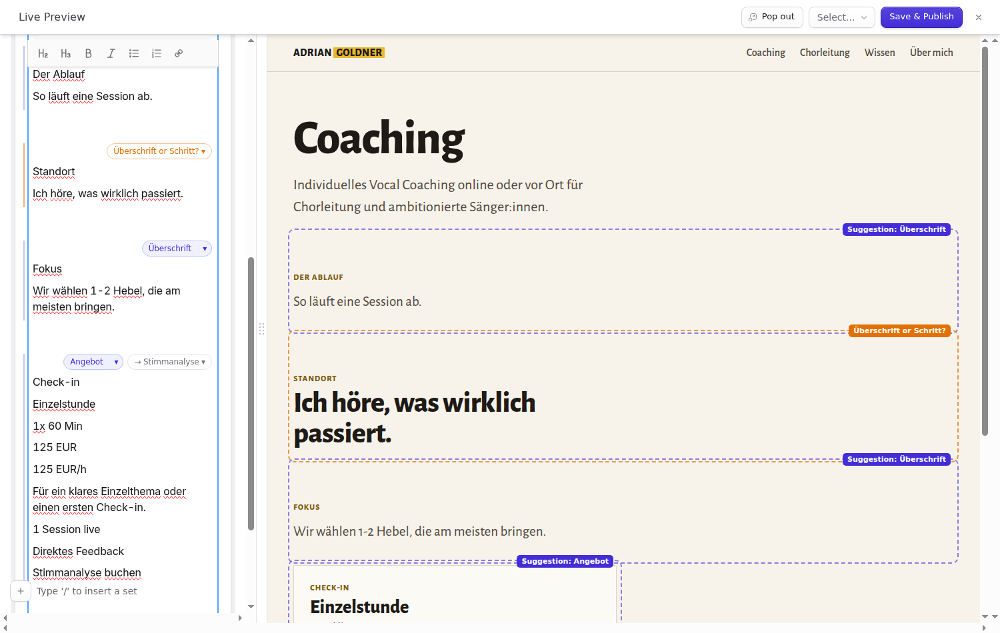

<!-- statamic:hide -->
# Bard Assist

> Write plain text in Bard. Bard Assist suggests which of your sets each paragraph should become, and fills in the set's fields.
<!-- /statamic:hide -->



Editors write the way they think: a heading, a sentence, a price, a button label, one paragraph after another. Turning that into the right Bard sets usually means knowing the blueprint by heart. Bard Assist reads each block of paragraphs and proposes a set from the field's own configuration, which line goes into which field, and where a link should point. Nothing changes until the editor accepts, and every acceptance can be undone.

The suggestions come from [Jev](https://typesafe.ai), a classification model by TypeSafe. It chooses between options you define and returns probabilities. It does not write text.

## Requirements

- Statamic 6.34+ (Bard)
- PHP 8.2+
- An API key for TypeSafe, either directly or through the Vercel AI Gateway

## Installation

```bash
composer require goldnead/statamic-bard-assist
```

Statamic publishes the editor script to `public/vendor/statamic-bard-assist` during install. If you ever need to do it by hand, run `php artisan vendor:publish --tag=bard-assist --force` (also after updating).

Then add your key to `.env`:

```env
BARD_ASSIST_API_KEY=your-key
```

### Getting a key

- **TypeSafe directly** (default): create a key at [typesafe.ai](https://typesafe.ai). `TYPESAFE_API_KEY` is read as a fallback if `BARD_ASSIST_API_KEY` is not set.
- **Vercel AI Gateway**: create an AI Gateway key in your Vercel dashboard and set `BARD_ASSIST_PROVIDER=vercel`. The gateway calls the model `typesafe-ai/jev`; your Vercel plan must allow it.

Without a key, an opted-in Bard field shows a short notice above the text and makes no requests.

## Usage

### 1. Opt a Bard field in

Open the blueprint, edit the Bard field and switch on **Bard Assist**. In YAML that is:

```yaml
content:
  type: bard
  bard_assist: true
  sets:
    blocks:
      sets:
        step:
          display: Step
          instructions: 'One step in a process: a short name and one explaining sentence. Usually follows a heading about a process or another step.'
          fields:
            - { handle: title, field: { type: text, display: Name, instructions: 'Short name of the step' } }
            - { handle: text, field: { type: textarea, display: Explanation, instructions: 'The explaining sentence' } }
```

### 2. Steer it with `instructions`

The model only knows what the blueprint tells it:

- A **set's** `display` and `instructions` describe what that block is. Write them the way you would explain it to a new editor: what it contains, what it does not, where it usually sits on the page.
- A **field's** `instructions` (or its `display`) decide which line goes into it. Only line-like fields are filled: `text`, `textarea`, `list` and `markdown`. A `list` field collects every line assigned to it.
- The first two `text` fields of a set keep their blueprint order. This is what keeps an eyebrow line above its heading.
- A `link` field is filled when the line-like field **directly before it** is its label (for example `button_text` followed by `button_link`). The target is picked from your entries, or taken from a URL in the paragraph.

When an editor corrects a suggestion, the correction is remembered in their browser (the last twelve, per field) and sent along as a house example with the next requests.

### 3. Write

Type paragraphs separated by an empty line. After a short pause each block gets a pill:

- **A suggestion** (`Step`): click it or press ⌥↩ (Alt+↩) to turn the block into that set. The arrow opens the other sets with their probabilities.
- **A question** (`Step or Quote?`): below the threshold, Bard Assist asks instead of guessing.
- **Field names** at the right of each line of the active block: click one to move the line to another field, or to leave it out.
- **Link target** (`→ Contact`): click to choose another entry.
- **Accept all** in the bar above the text accepts every confident suggestion at once.

A set created this way carries a **✦ From your text** pill in its header: **Back to text** turns it back into the original paragraphs, **Other set …** does that and opens the choice again.

## Live preview

Bard Assist can show its suggestions in Statamic's live preview, as dashed blocks drawn with your own templates, before anything is accepted.

1. **One partial per set**, following Statamic's convention: `resources/views/partials/sets/{handle}.antlers.html` (or `_step.antlers.html`). The set's values are available as variables, plus `type`. Render your Bard field with the same partials, for example:

   ```antlers
   {{ content }}
     {{ if type == "text" }}
       <div class="text">{{ text }}</div>
     {{ else }}
       {{ partial src="sets/{type}" }}
     {{ /if }}
   {{ /content }}
   ```

   Sets without a partial are simply not shown in the preview. Change the location with `preview.partial`.

   For the preview, the suggested values are HTML-escaped before your partial runs, so typed markup shows as text. If a partial escapes again itself (`| entities` or similar), the preview may show `&amp;` where the accepted set will not. Markdown fields appear as plain text in the preview.

2. **The tag at the end of your layout's `<body>`:**

   ```antlers
   {{ bard_assist:live_preview }}
   ```

   It outputs a small script, and only inside a live preview request.

3. **A preview target without refresh** on the collection, so the preview is updated in place instead of reloaded (no flicker):

   ```yaml
   # content/collections/pages.yaml
   preview_targets:
     -
       label: Entry
       url: '{permalink}'
       refresh: false
   ```

## Configuration

Publish the config file if you want to change a default:

```bash
php artisan vendor:publish --tag=bard-assist-config
```

| Key | Default | What it does |
|---|---|---|
| `provider` | `typesafe` (`BARD_ASSIST_PROVIDER`) | `typesafe` or `vercel`. Anything else is reported as an error in the editor. |
| `api_key` | `BARD_ASSIST_API_KEY`, then `TYPESAFE_API_KEY` | Stays on the server; the editor calls the provider through the control panel. |
| `endpoint` | provider default | Override the URL, e.g. for your own proxy. |
| `model` | provider default | `jev-latest` (TypeSafe) or `typesafe-ai/jev` (Vercel). |
| `timeout` | `6` | Seconds per request. |
| `rate_limit` | `240` | Requests per user and minute through the proxy. Above it the editor shows a "wait a minute" notice. |
| `threshold` | `0.6` | Confidence from which a suggestion is offered as the answer. Below it, the editor is asked. |
| `targets.collections` | `null` | Collections link targets come from. `null` means every collection with a route. |
| `targets.description_field` | `description` | Field that tells the model what an entry is about. Without it, the title is used. |
| `targets.limit` | `100` | Most entries offered per request. |
| `preview.partial` | `partials/sets/{handle}` | Partial a suggested set is drawn with in the live preview. |

All endpoints are control panel routes: only signed-in users reach them. Classifying, building and rendering a set also require the publish form's own blueprint token (as in core) and a Bard field that opted in, so the key can only be spent from an entry form. Anyone who can open such an entry form can still send their own requests through the proxy on your key; `rate_limit` caps how many per minute. Requests are size-limited (100 questions, 64 KB of text). Link targets are limited to collections the user may view and to the site selected in the control panel. The live preview escapes the editor's text before drawing a suggestion.

The editor script (`resources/dist/js/bard-assist.js`) is hand-written and is its own source; there is no build step.

## Multi-site

Nothing is stored per site. Suggestions work on whichever localization is being edited. Link targets come from the site selected in the control panel's site switcher, with their URLs as Statamic returns them.

## Privacy

When an opted-in field is edited, the text of the paragraphs being classified (and of the neighbouring ones, for context), the names and instructions of the field's sets and fields, and the titles, URLs and descriptions of possible link targets are sent to **TypeSafe** (`api.typesafe.ai`, a US provider) or, with `provider: vercel`, to **Vercel** (`ai-gateway.vercel.sh`), which forwards them to TypeSafe. Nothing is sent for fields that did not opt in, and nothing is sent without a key.

**Corrections travel too.** When an editor picks a different set than suggested, that paragraph (up to 300 characters) and the chosen set are stored in the browser's `localStorage`, the twelve most recent per field handle. These house examples are sent along with **every** classification request from that field, in any entry, so text from other entries and other pages can reach the provider as well. The storage belongs to the browser, not to the Statamic user: someone else signing in on the same browser profile uses, and sends, the same examples. Clearing the site data for the control panel removes them.

If your content contains personal data, you are responsible for a data processing agreement with the provider and for informing your editors. Bard Assist stores nothing on the server. There is no telemetry and no licence check.

## Limitations

- **It suggests, it does not decide.** The same text can get a different suggestion on another run. That is why nothing is applied without a click, and why uncertain cases are asked instead of guessed.
- **It does not write text.** It sorts the editor's own lines into sets and fields; it never rephrases, completes or translates.
- Top-level Bard fields only; Bard fields nested inside a Replicator, Grid or another set are not supported yet.
- Only line-like fields (`text`, `textarea`, `list`, `markdown`) and one `link` field per set are filled. Other fields keep their defaults.
- Each request costs a call to the provider. Requests are sent after a short typing pause and only for blocks that changed.

## Uninstalling

Switch the toggle off (or remove `bard_assist: true`), remove the tag from your layout, then `composer remove goldnead/statamic-bard-assist`. Sets created with Bard Assist are ordinary Bard sets and stay as they are.

## Development

```bash
composer test      # PHPUnit, all outbound HTTP faked
composer lint      # Pint
composer analyse   # PHPStan level 5
```

`tests/browser/smoke.cjs` is a Playwright smoke test (accept a suggestion, then "Back to text") against a real site with the addon installed and a working key. It is not part of `composer test`; the header of the file says how to run it.

## Support

Only the latest release is supported, on Statamic 6. Report bugs as issues in the addon's repository; bugs in Statamic itself belong to [statamic/cms](https://github.com/statamic/cms). Security reports: see [SECURITY.md](SECURITY.md).

## Changelog

See [CHANGELOG.md](CHANGELOG.md).

## License

MIT, see [LICENSE.md](LICENSE.md).
